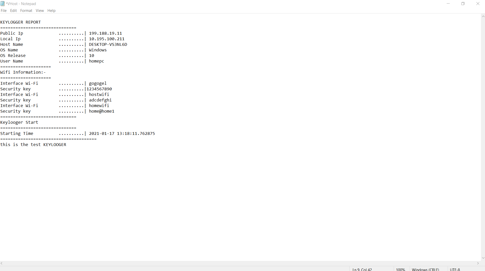
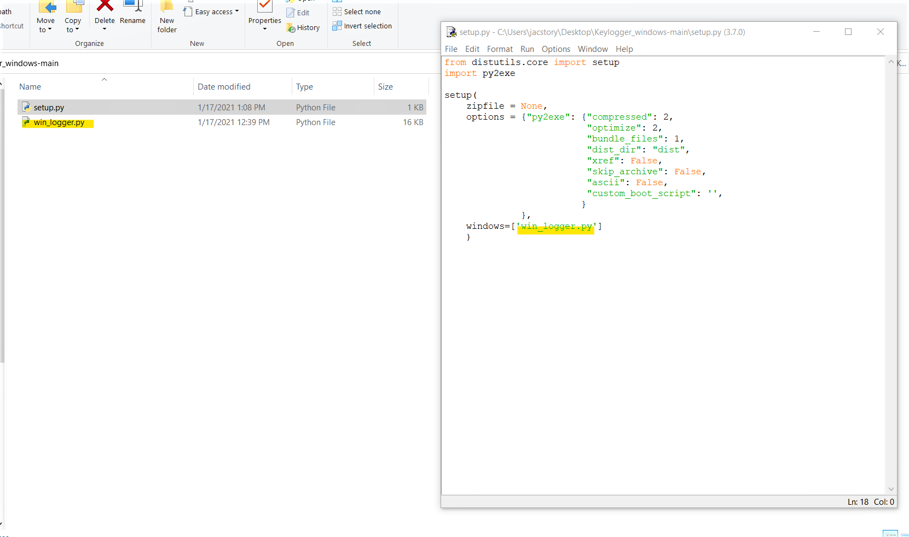
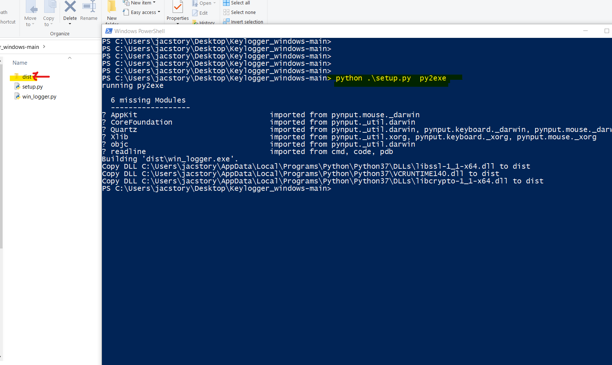
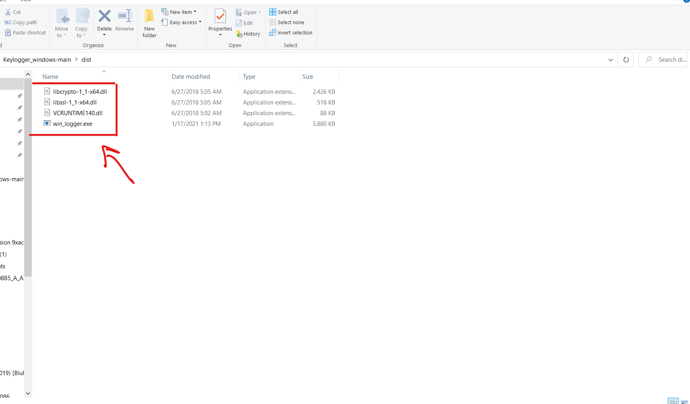
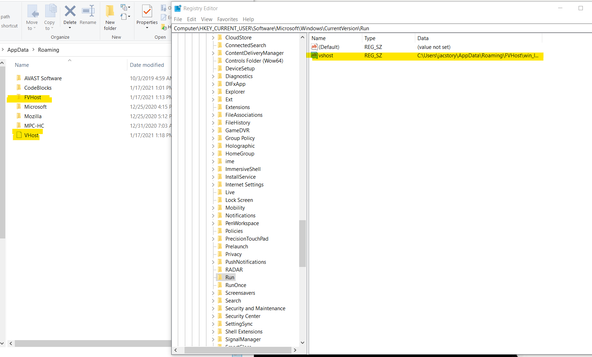
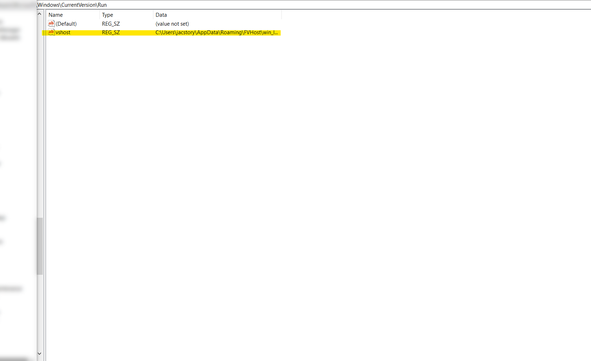
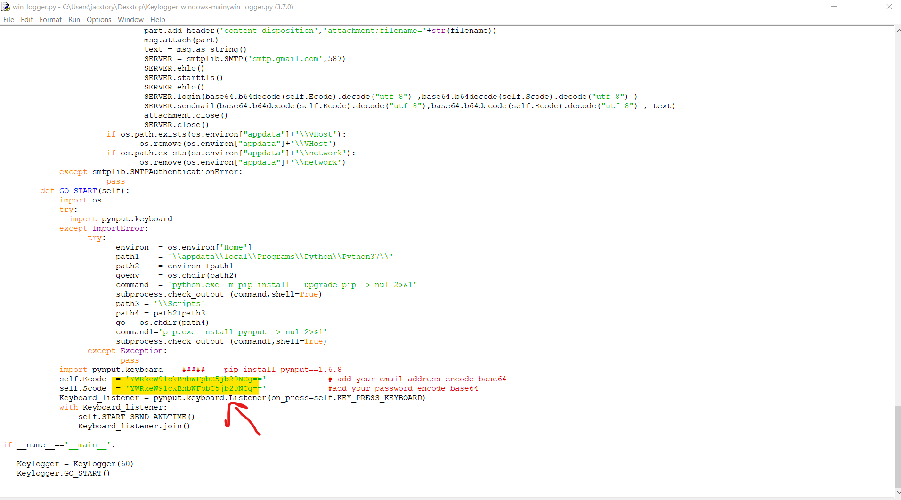
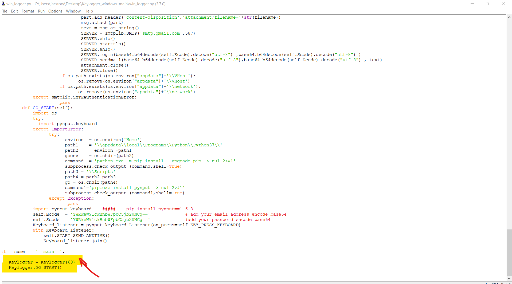

# Keylogger_windows

* a computer program that records every keystroke made by a computer user, especially in order to gain fraudulent access to passwords and other confidential information. 
* keylogger use pynput 
* written by python 3.7 

## required
###  compile to exe file install 
* pip install pynput==1.6.8 
* pip install py2exe==0.10.2.0
* link py2exe
* https://www.py2exe.org/

## features:-

* handle the backspace key
* handle the Caps Lock key
* run in background
* send email attached log file 
* grep public IP 
* grep local IP
* grep user name
* grep host name
* grep ssid name and WIFI password

### logfile

 
 
##  how to use    :-
### complie to exe file execute

* go to link 
* https://www.github.com/jac11/keylogger_windows.git
* downlod the code zipfile
* unziped the file 
* open cmd from same dir
* make sure add python to Environment Variables
* run this command 'python setup.py py2exe'
* make sure the file setup.py at same dir to make compile succeeded 
* after compile you will get the folder dist have the  exe file execute at same dir 
* copy folder dist to USB ready to use

  

### run exe file: -

* run the exe file as normal way 
* program.exe  will copy all dll file and program itself to the folder in %appdata% 'Roaming' under the name FVHost folder 
* code will add key in the regdster this path 'Computer\HKEY_CURRENT_USER\Software\Microsoft\Windows\CurrentVersion\Run'  to run as startup service 
the key name is 'vshost'
* log file under the name 'VHost' in roaming

  

## send email :-
* keylogger will send email to your Gmail account 
* encode your email and password bes64 and add to the  variable see the pic down blow 
* keylogger  will do  auto decode bes64 then will send email
*  set the timer for email by second so if you set after 1 min set 60 second
* * online web convert from minutes to seconds  https://www.convertunits.com/from/minutes/to/seconds

## Language support :-
* the code by default encoder is UTF-8 
* English language 
* UTF-8 support Unicode so can work fine with other language 
### Recommendations:-
* to Complie from python to exe use windows 10
* change the name file or folder in the script path it maybe broke the code so keep the names as itis  
## connect me :-
* administrator@jacstory.tech
* thank you 

